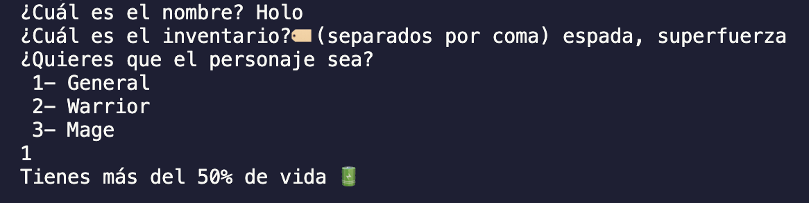
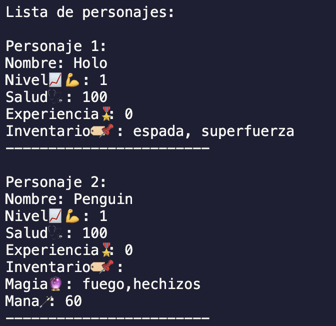
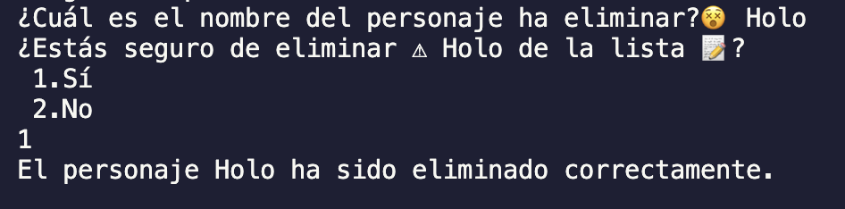
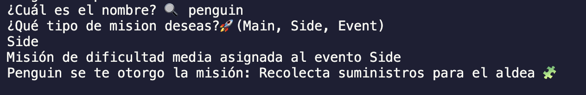
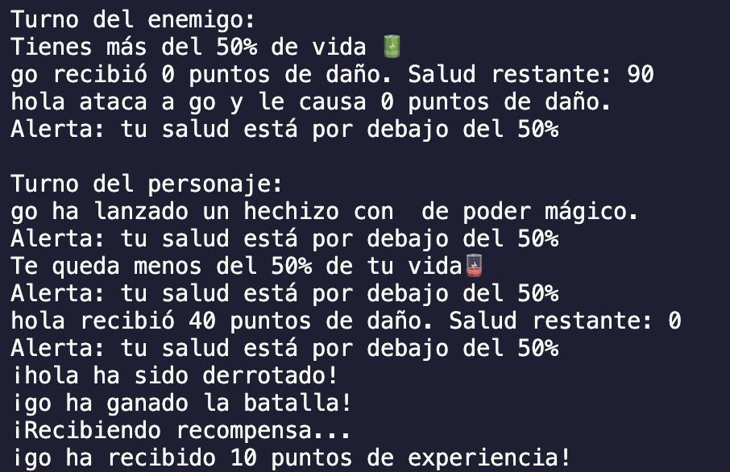

# 🎮 Videojuego 👾  

Este proyecto tiene como objetivo desarrollar una Api diseñada para gestionar y diseñar personajes y misiones en un videojuego destacando el uso de la programación orientada a objetos (POO), typescript,entre otros. Utilizando herramienta de control de git y github. 


## Estructura del Proyecto ✨🤓

#### 📁 videojuegoApi
| Estructura                     | Descripción                                                           |
|--------------------------------|-----------------------------------------------------------------------|
| 📁 controllers                 | Contiene los controladores para manejar la lógica del juego.          |
| └─ 📑 gameController.ts          | Controlador principal para gestionar las operaciones del videojuego.  |
| 📁 models                      | Contiene los modelos de datos que representan las entidades del juego.|
| └─ 📄 characterModel.ts          | Modelo que interactúa con los datos de los personajes.               |
| └─ 📄 mageModel.ts               | Modelo que gestiona las habilidades mágicas.                         |
| └─ 📄 missionModel.ts            | Modelo para manejar las misiones del juego.                          |
| └─ 📄 warriorModel.ts            | Modelo para gestionar los ataques y defensas.                        |
| 📁 views                       | Contiene las vistas que interactúan con el usuario.                  |
| └─ 📄 index.ts                   | Punto de entrada del proyecto.                                       |
| README.md                      | Instrucciones y detalles del proyecto.                               |
| package.json                   | Archivo de configuración del proyecto.                               |


## 🎯🚀 Skills

- Typescript
- MVC
- Herencias
- Programación Asíncrona
- Promesas y Callbacks

##  👩🏻‍💻📓✍🏻💡 Como configurar el Proyecto
### Pasos a seguir en consola**
Ejecuta el siguiente bloque de comandos en tu terminal para configurar el proyecto:

**1. Instalar la dependencia**
```bash
  npm install
```
**2. Inicializar el proyecto**
```bash
  npm init -y
```
**3. Instalar la dependencia**
```bash
  npm install typescript ts-node @types/node --save-dev
```

**4. Configura TypeScript**
```bash
  npx tsc --init
```

#### 📜🛠️ Ejecución
El proyecto inicializa con:
```bash
  npm start
```
##  ✍🏻📚 Modelos
En esta guía de uso se divide en diferentes secciones enfocadas en un aspecto fundamental del videojuego.
### Personajes 
Se divide en 3 models:

1. **(Character)**
Es la base principal de nuestra api donde encontraras propiedades como:
* Definición de atributos:
  - Nombre: Identificador principal.
  - Nivel: El nivel actual del personaje
  - Vida: Salud actual. 
  - Experiencia: La experiencia acumulada por el personaje 
  - Inventario: Array que contiene el inventario del personaje.
* Metodo
  - win: Se ejecuta cuando el personaje completa una misión y recibe experiencia.
  - lose: Se ejecuta si el personaje no completo la misión.
2. **Warrior**
* Definición de atributos:
  - Ataque: El poder de ataque del guerrero
  - Defensa:  El poder de defensa del guerrero
3. **Mage**
* Definición de atributos:
  - Magía (Inventario).
  - Mana: El poder de Magía que tiene 
4. **(Mission)**
* Atributos :
  - Description: La descripción de la misión. 
  - Difficulty:  La dificultad de la misión (por ejemplo, fácil, media, difícil).
  - Reward:  La recompensa asociada a completar la misión.
  - Tipos de misiones El tipo de misión (puede ser "Main", "Side", "Event").
* Metodos
  - getMissionAleator: Asigna de manera aleatoria una descripción y una dificultad a la misión, dependiendo de su tipo.
  - getExperienceReward: Calcula y retorna la cantidad de experiencia ganada al completar la misión, basándose en el tipo y la dificultad de la misión.
  - getAleatoryWin:  Determina si el personaje tiene éxito al intentar completar la misión

##  ✍🏻📚 Guía de uso:
**Creación de Personaje:**

- En esta sección podrás crear tu personaje agregando el inventario de herramientas, fortalezas. 



**Lista de Personajes:**

- Visualizar todos los personajes creados.



**Editar Personaje:**

- Se editan los atributos de los personajes.

**Eliminar de Personaje:**

- Se puede eliminar a los personajes que tienes en la lista.



**Asignar Mision:**




**Pelea:**



**Recursos Utilizados**

[Sumar sin exceder un valor maximo](https://developer.mozilla.org/es/docs/Web/JavaScript/Reference/Global_Objects/Math/max)

[Random item de un array](https://www.programiz.com/javascript/examples/get-random-item)

Desarrollado con 💜 por Gaby by [Ada](https://adaitw.org/)